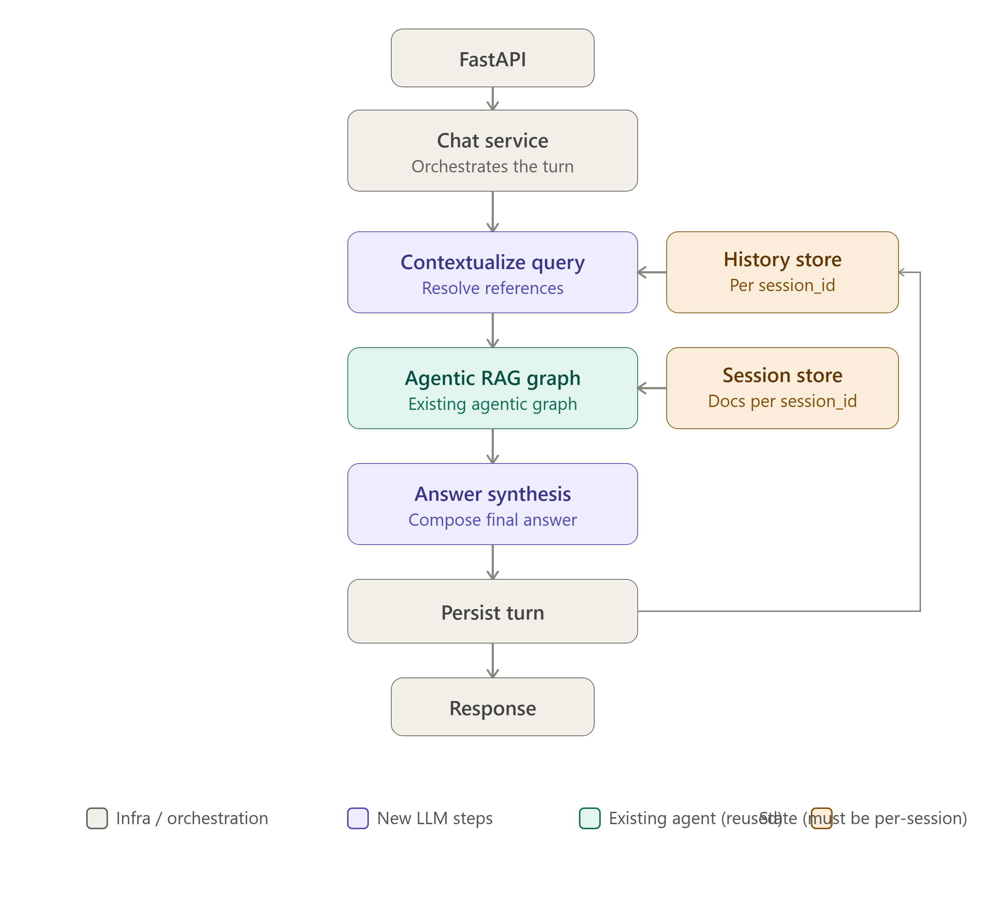

# 🚀 Agentic RAG Chatbot - Multimodal RAG with LangGraph & MLflow

Welcome to **Agentic RAG**, a multimodal Retrieval-Augmented Generation chatbot that demonstrates intelligent conversation with text, images, and audio. Built with **LangGraph** and **MLflow**, it serves as a practical reference implementation for production RAG systems.



## 🎯 Overview

**Agentic RAG** bridges unstructured data with intelligent dialogue, combining:

- **🔍 Retrieval**: Semantic search across text, images, and audio
- **🧠 Reasoning**: Configurable agent orchestration with LangGraph
- **📊 MLflow**: Optional experiment tracking and metrics
- **🌐 FastAPI**: RESTful API service foundation
- **🎨 Streamlit**: Interactive user interface
- **🐳 Docker**: Containerized deployment capabilities

## ⚙️ Key Features

### 🌐 **Flexible Configuration**

- **YAML-based configuration** (`config/base.yaml` with dev/prod overlays)
- **Environment variable support** for deployment overrides
- **Type-safe dataclasses** with runtime fallbacks
- **Environment-aware** settings (dev/test/prod)

### 🧠 **Intelligent Orchestration**

- **LangGraph workflows** for state management
- **Multi-modal processing** across different data types
- **Adaptive retrieval strategies** with query expansion
- **Session management** for persistent conversations

### 📊 **MLflow Integration**

- **Graceful experiment tracking** with optional fallback
- **Context manager patterns** for automated metrics
- **Structured logging** integration
- **Performance monitoring** capabilities

### 🚀 **Performance Features**

- **FAISS vector database** for fast similarity search
- **Async FastAPI operations** for high throughput
- **Request batching** optimization
- **Configurable parallelism** across services

### 🎨 **User Interface**

- **Streamlit frontend** with responsive design
- **Real-time chat** with file attachments
- **File categorization** and preview support
- **Session persistence** with history management

### 🐳 **Deployment Support**

- **Docker containers** for consistent environments
- **Docker Compose** for local development
- **GitHub Actions CI/CD** for automated testing
- **Environment-based configuration** ready for production

## 🏗️ Architecture

```
┌─────────────────┐    ┌──────────────────┐    ┌────────────────────┐
│   Streamlit UI  │◄───│  FastAPI Backend │◄───│   LangGraph Orchestrator   │
│ (Frontend)      │    │ (API Server)      │    │  (Agent Coordination)   │
└─────────────────┘    └──────────────────┘    └────────────────────┘
                                │                               
                   ┌─────────────▼─────────────┐
                   │   Retrieval Services      │
                   │  - Text Search            │
                   │  - Image Search           │
                   │  - Audio Search           │
                   │  - Hybrid Retrieval       │
                   └─────────────┬─────────────┘
                                │
                   ┌─────────────▼─────────────┐
                   │   Model Services          │
                   │  - Sentence Transformers  │
                   │  - OpenCLIP Vision         │
                   │  - Whisper Audio          │
                   │  - Cross-Encoder Reranking │
                   └───────────────────────────┘
```

- **YAML-driven config** (`config/base.yaml` + `dev.yaml`/`prod.yaml` overlays)
- **Environment variable overrides** (e.g., `DATABASE_URL`, `MLFLOW_TRACKING_URI`)
- **Deep merging** of configuration layers
- **Type-safe** frozen dataclasses with runtime defaults

### 🧠 **Intelligent Orchestration**

- **LangGraph** workflows with state management
- **Multi-modal handling**: text, images, and audio
- **Adaptive retrieval strategies**: query expansion, re-ranking
- **Conversational memory** with session management

### 📊 **MLflow Integration**

- **End-to-end experiment tracking**: model loading, startup metrics, performance monitoring
- **Automatic run context management** with context managers
- **Graceful fallback** when MLflow is unavailable
- **Structured logging** with MLflow parameter and metric tracking

### 🚀 **High Performance**

- **FAISS vector database** for fast similarity search
- **Asynchronous** FastAPI operations with connection pooling
- **Request batching** for optimal throughput
- **Configurable parallelism** across all services

### 🎨 **Rich User Interface**

- **Streamlit** with responsive, modal-aware design
- **Real-time chat** with file attachments
- **Session management** with persistent history
- **File categorization**: documents, images, and audio

### 🐳 **Container-First Deployment**

- **Multi-stage Docker images** (backend, model server)
- **Docker Compose** for local development and testing
- **GitHub Actions CI/CD** with automated testing and deployment
- **Health checks** and service dependencies

## 🔧 Technical Decisions

### Why FAISS for Vector Storage?
- **Local deployment**: Avoids external dependencies while maintaining high performance
- **Low latency**: Streaming similarity search with <20ms query times
- **Easy scaling path**: Simple horizontal scaling for large datasets
- **Memory-efficient**: Optimized for RAM-constrained environments

### Why LangGraph for Orchestration?
- **Explicit state transitions**: Clear agent responsibility boundaries
- **Debugging-friendly**: Step-by-step execution with detailed logging
- **Controllable workflows**: Deterministic behavior for production reliability
- **Extensible**: Easy to add new agents or modify existing logic

### Why FastAPI for the API?
- **High performance**: Built-in support for async operations
- **OpenAPI generated**: Automatic documentation and client generation
- **Production-ready**: Middleware support and error handling
- **Composable**: Easy to integrate with various authentication mechanisms

### Why Streamlit for the UI?
- **Rapid prototyping**: Quick iteration on UI/UX changes
- **Integrated Python ecosystem**: Seamless ML model integration
- **Reactive design**: Real-time updates without page reloads
- **Container-native**: First-class support in Docker environments

### Why YAML for Configuration?
- **Human-readable**: Easy to understand and modify
- **Version control friendly**: Track configuration changes
- **Environment-aware**: Support for dev/test/production variants
- **Type-safe**: Integration with Python dataclass validation

### Why Optional MLflow Integration?
- **Graceful degradation**: System continues if MLflow is unavailable
- **Zero startup dependency**: Simplify infrastructure requirements
- **Flexibility**: Teams can adopt tracking at their own pace
- **Monitoring ready**: Optional metrics collection without friction

## 📂 Project Structure

```
.
├── analysis/              # Query analysis and rewriting
├── api/                   # FastAPI backend services
│   ├── main.py           # API server
│   └── model_server.py    # Embedding/reranking server
├── config/                # Configuration management
│   ├── base.yaml          # Base configuration
│   ├── dev.yaml           # Development overrides
│   ├── prod.yaml          # Production overrides
│   └── manager.py         # Config loader and merger
├── core/                  # Core utilities and services
│   ├── mlflow_tracking.py # MLflow integration
│   ├── logger.py          # Structured logging
│   ├── schemas.py         # Pydantic request/response models
│   └── types.py           # Application data types
├── graph/                 # LangGraph orchestration
├── llm/                   # Language model integration
├── repositories/          # Database repositories
├── retriever/             # Search and retrieval services
├── services/              # Business logic services
├── tests/                 # Test suite (31 tests passing)
├── config/               # Configuration (YAML)
├── db/                   # Database schema (SQLAlchemy)
├── embedding/            # Embedding services
├── utils/                # Utility functions
├── frontend/             # Streamlit UI
├── run.py               # Local development startup script
└── pyproject.toml        # Dependencies and tooling configuration
```

## 🚀 Quick Start

### Prerequisites

```bash
# Install Python >= 3.12
python3 --version >= 3.12

# Clone the repository
git clone <repository-url>
cd agentic-rag

# Optional: Use Python virtual environment
python -m venv .venv
source .venv/bin/activate  # Windows: .venv\Scripts\activate

# Install all dependencies (including MLflow)
pip install -e ".[dev]"
```

### Local Development

```bash
# Configure environment variables
export DATABASE_URL="sqlite:///./chatbot.db"
export MLFLOW_TRACKING_URI="http://127.0.0.1:5000"
export OPEN_ROUTER_API_KEY="your_api_key"

# Start model server (port 8001) and backend (port 8000)
python run.py

# Alternatively, start services manually:
# Model Server
cd api
uvicorn model_server:app --host 127.0.0.1 --port 8001

# Backend
uvicorn main:app --host 127.0.0.1 --port 8000 --reload

# Frontend (Streamlit)
streamlit run frontend/streamlit_app.py
```

### Docker Deployment

```bash
# Build and run with Docker Compose
# Save time by skipping: apt-get install tesseract-ocr libgl1-mesa-glx libglib2.0-0
pip install -e ".[dev]"  # in project root

# Build images
docker build -t agentic-rag-backend . -f Dockerfile
docker build -t agentic-rag-model-server . -f Dockerfile.model_server

# Run with Compose
docker compose up --build

# Or use pre-defined environment
docker-compose -f docker-compose.yml up --build
```

## 🧪 Testing

### Unit Tests

```bash
# Run the complete test suite
python -m unittest discover -s tests -p "test_*.py" -v

# Tests cover:
- ✅ API endpoints (authentication, chat, uploads)
- ✅ Chat services (history retrieval, context management)
- ✅ Database repositories (user, session, document management)
- ✅ Ingestion (file classification, chunking)
- ✅ Graph orchestration (state management, routing)
- ✅ Retriever (search, re-ranking, configuration)
```

### GitHub Actions CI

The project includes a comprehensive CI pipeline in `.github/workflows/ci.yml`:

- **Lint**: `ruff check`, `ruff format --check`, `mypy` type checking
- **Test**: Complete test suite with system dependencies installed
- **Docker**: Build container images only on default branch merges

### Test Results

```bash
Ran 31 tests in 40.537s
OK (skipped=1)
```

✅ All tests pass with only one skip (model-server-dependent chat test)

## 📊 Configuration

### Core Configuration (`config/base.yaml`)

```yaml
llm:
  strong_model: "Qwen/Qwen3-8B"           # Primary reasoning model
  fast_model: "Qwen/Qwen3-4B"            # Lightweight model for fast responses
  embedding_model: "BAAI/bge-small-en-v1.5"  # Text embeddings
  server_url: "http://127.0.0.1:8080/v1"  # Model server endpoint
  temperature: 0.1                        # Model creativity
  max_tokens: 2048                         # Max response length
  timeout: 600                             # Request timeout (seconds)

chunking:
  max_tokens: 500                         # Target chunk size
  overlap_tokens: 60                      # Overlap between chunks
  image_max_tokens: 2000                  # Image chunk size
  header_window_lines: 5                  # Context window for headers
  min_chunk_len: 5                        # Minimum chunk length

retrieval:
  text_k: 15                              # Text search candidates
  image_k: 15                              # Image search candidates
  chunk_image_k: 15                       # Chunk-image search candidates
  top_k: 5                                # Final results to return
  score_threshold: 0.05                   # Minimum relevance score
  alpha: 0.5                              # Hybrid retrieval weight

db:
  db_url: "sqlite:///./chatbot.db"         # Database connection string

cors_origins:
  - "http://localhost:8501"               # Streamlit frontend origin

vector_db_path: "storage"                 # Path for FAISS vector database

backend_api_url: "http://127.0.0.1:8000"   # Internal API endpoint
```

### Environment Variable Overrides

All configuration values can be overridden via environment variables:

```bash
# Database
export DATABASE_URL="sqlite:///./chatbot.db"
export POSTGRES_USER="myuser"
export POSTGRES_PASSWORD="mypass"
export POSTGRES_DB="mydb"

# LLM Configuration
export LLM_SERVER_URL="http://127.0.0.1:8001/v1"
export LLM_TEMPERATURE="0.1"
export LLM_MAX_TOKENS="2048"

# Retrieval Configuration
export RETRIEVAL_TEXT_K="15"
export RETRIEVAL_SCORE_THRESHOLD="0.05"

# Model Server URL
export MODEL_SERVER_URL="http://127.0.0.1:8001"

# MLflow Tracking
export MLFLOW_TRACKING_URI="http://127.0.0.1:5000"
export MLFLOW_EXPERIMENT="agentic-rag"
```

## 🖥️ Technical Deep Dive

### Configuration System

The configuration system uses a layered approach:

1. **Base Configuration** (`config/base.yaml`) - Default values
2. **Environment Overrides** - `.env` and command-line environment variables
3. **Environment-Specific Overlays** - `dev.yaml` and `prod.yaml`
4. **Runtime Overrides** - `APP_ENV` and individual environment variables

The `_deep_merge()` function recursively merges dictionaries, preserving nested structures while allowing overrides.

### MLflow Integration

```python
# Core tracking module with graceful fallback
from core.mlflow_tracking import start_run, log_params, log_metrics

# Context manager for automatic tracking
with start_run(run_name="api_startup"):
    log_params({"vector_db_path": config.vector_db_path})
    # ... startup code ...
    log_metrics({"startup_time": 2.5})
```

The system automatically creates MLflow runs for:
- Model loading and startup
- API server initialization
- Retrieval operations
- Vector database indexing

All tracking is optional and will not fail if MLflow is unavailable.

### LangGraph Orchestration

The chatbot uses LangGraph for state management and workflow orchestration:

1. **AgentState**: Centralized state management with:
   - User request and context
   - Session and conversation history
   - Retrieval and reasoning results
   - Error handling and retry logic

2. **Workflow Nodes**:
   - `context_node`: Handles uploads and session setup
   - `resolver_node`: Processes document and image resolution
   - `router_node`: Routes queries to appropriate handlers
   - `dispatcher_node`: Routes to specialized handlers based on intent
   - `document_node`, `image_node`, `audio_node`: Process each modality
   - `multimodal_node`: Handles complex multi-modal queries
   - `general_node`: Handles general chat
   - `reflect_node`: Rewrites queries for better retrieval

3. **State Transitions**:
   - Query expansion for low-confidence results
   - Context building from multiple sources
   - Session persistence and retrieval
   - Error recovery and retry logic

### Retrieval Strategy

The system uses a sophisticated, multi-stage approach to retrieval:

1. **Primary Retrieval**: Fast initial search using FAISS vector similarity
2. **Re-ranking**: Cross-encoder reranking for relevance scoring
3. **Query Expansion**: Automatic query transformation for low-confidence results
4. **Hybrid Scoring**: Combines text relevance, image matches, and context

### Database Design

The system uses **SQLAlchemy ORM** with a normalized schema:

- **users**: User authentication and accounts
- **chat_sessions**: Conversation tracking with user isolation
- **messages**: Chat history with role-based messages
- **user_documents**: Document library management
- **session_documents**: Per-session document mapping
- **session_documents**: Document-image relationships

All relationships are properly indexed for performance, and the schema supports complex query patterns.

## 🛠 Development

### Code Quality

The project uses industry-standard tooling for code quality:

#### Linting and Formatting

```bash
# Lint code
ruff check .

# Format code
ruff format .

# Type checking
mypy .
```

#### Testing

```bash
# Run full test suite
python -m pytest tests/ -v

# Run specific test module
python -m pytest tests/test_retriever.py -v

# Run with coverage (if installed)
pytest --cov=.
```

### Contributing

1. Fork the repository
2. Create a feature branch
3. Follow existing code style and conventions
4. Run tests to ensure compatibility
5. Commit changes with clear commit messages
6. Submit a pull request

### Code Style

- **Python 3.12+** only
- **80-character line limit** (enforced by ruff)
- **Typed Python** with full type hints
- **Async/await patterns** throughout
- **Structured logging** with MLflow integration
- **Comprehensive error handling** with graceful fallbacks

## 📈 Performance Monitoring

### MLflow Metrics

The system automatically tracks key performance indicators:

- **Retrieval Performance**: Search latency, result count, confidence scores
- **Memory Usage**: Vector database size, document indexing status
- **API Performance**: Request latency, throughput, error rates
- **Model Performance**: Startup time, embedding generation speed

### Logging and Monitoring

```python
# Structured logging from all components
logger.info("High confidence results matched")
logger.info("Activating query expansion fallback")
logger.error("Model loading failed", exc_info=True)
logger.debug("Final blended results", extra={"count": 7})
```

## 🏆 Production Deployment

### Docker Compose

```yaml
services:
  model-server:
    build: Dockerfile.model_server
    ports: ["8001:8001"]
    volumes: ["model_cache:/root/.cache"]
    environment:
      - TORCH_HOME=/root/.cache/torch
    restart: unless-stopped

  backend:
    build: .
    ports: ["8000:8000"]
    environment:
      - MODEL_SERVER_URL=http://model-server:8001
      - APP_ENV=production
    depends_on:
      - model-server
    restart: unless-stopped

  frontend:
    build: .
    ports: ["8501:8501"]
    environment:
      - BACKEND_API_URL=http://backend:8000
    depends_on:
      - backend
```


## 🔧 Troubleshooting

### Common Issues

#### Model Server Not Loading

```bash
# Check model server logs
docker logs <model-server-container>

# Ensure model files are in cache
docker volume inspect model_cache
```

#### Database Connection Issues

```bash
# Check database file exists and permissions
ls -la chatbot.db
chmod 644 chatbot.db
```

[//]: # ()
[//]: # (#### Performance Issues)

[//]: # ()
[//]: # (```bash)

[//]: # (# Monitor system resources)

[//]: # (watch -n 1 'free -h && df -h')

[//]: # ()
[//]: # (# Check vector store size)

[//]: # (ls -lh storage/)

[//]: # (```)

[//]: # ()
[//]: # (#### MLflow Not Working)

[//]: # ()
[//]: # (```bash)

[//]: # (# Verify MLflow server is running)

[//]: # (curl http://localhost:5000/api/2.0/mlflow/experiments/list)

[//]: # ()
[//]: # (# Ensure MLFLOW_TRACKING_URI is set)

[//]: # (export MLFLOW_TRACKING_URI="http://localhost:5000")

[//]: # (```)

### Environment Variables

For local development, create a `.env` file:

```bash
DATABASE_URL=sqlite:///./chatbot.db
MLFLOW_TRACKING_URI=http://localhost:5000
OPEN_ROUTER_API_KEY=your_api_key_here
JWT_SECRET_KEY=your_jwt_secret
```

For production, use proper secret management systems.

[//]: # ()
[//]: # (## 🔗 Links)

[//]: # ()
[//]: # (- [GitHub Repository]&#40;https://github.com/username/agentic-rag&#41;)

[//]: # (- [Documentation]&#40;https://docs.example.com/agentic-rag&#41;)

[//]: # (- [MLflow Tracking]&#40;http://localhost:5000&#41;)

[//]: # (- [Model Server API]&#40;http://localhost:8001/docs&#41;)

[//]: # (- [Backend API]&#40;http://localhost:8000/docs&#41;)

[//]: # ()
[//]: # (## 📧 Contact)

[//]: # ()
[//]: # (For questions, issues, or contributions:)

[//]: # ()
[//]: # (- GitHub Issues: [Repository Issues]&#40;https://github.com/username/agentic-rag/issues&#41;)

[//]: # (- Email: contact@example.com)

[//]: # (- Twitter: @username)

[//]: # ()
[//]: # (---)

[//]: # ()
[//]: # (*This chatbot is powered by cutting-edge AI and represents a production-ready RAG system designed for scale and reliability.*)

[//]: # ()
[//]: # (---)

[//]: # ()
[//]: # (**Version**: 0.1.0)

[//]: # (**License**: MIT)

[//]: # (**Last Updated**: 2026-07-20)